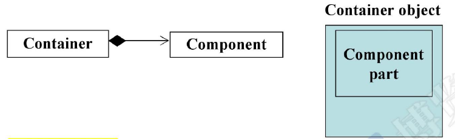
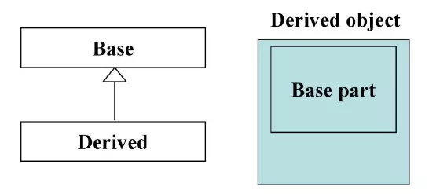

# C++面向对象--复合、委托、继承

面向对象(OOD)(OOP):在研究复杂问题时，需要使类和类之间产生关系。分别为Inheritance(继承承), Composition(复合), Delegation(委托)。

## 复合(composition,表示has a)

即一个类的中包含另一个类的成员。表示为has-a的关系



```c++
#ifndef __COMPOSITION__
#define __COMPOSITION__
#include <iostream>
#include <deque>
#include <vector>
using namespace std;

template <class T,class Sequence=deque<T>>
class queue
{
private:
    Sequence c;
public:
    bool empty() const{return c.empty();}
    vector<int>::size_type size() const {return c.size();}
    //reference front(){return c.front();}
    //reference back(){return c.back();}
    void push(const vector<int>::value_type& x){c.push_back(x);}
    void pop(){c.pop_front();}
};
#endif // __COMPOSITION_
```

​		在类里面定义一个已经定义好的类的成员，这里deque<T>已经定义好了。这样在queue类里面可以通过c随意使用deque<T>的成员函数。

　　在设计模式里，Adapter就是通过复合形成的，方法就是将已经设计好的类改造一下，例如将deque类的成员函数换一个名字。这样可以借助已经设计出来的类和接口，可以选择变量或者方法进行改装，封装成自己想到的类。上面这个例子就是Adapter的典型。

1.外部`Container`的构造函数首先调用内部`Component`的默认构造函数，然后才执行自己。在代码层面可以理解为：

```c++
Container::Container(...) : Component() {}
```

2.`Container`的析构函数首先执行自己，然后才调用`Component`的析构函数。在代码层面可以理解为：

```c++
Container::~Container(...) { ~Component();}
```

## 委托(Composition by reference)

composition by referrence   Handle/Body  在设计模式中的应用为pImpl，一个类的成员变量里面有另外一个类的指针，它的优点是可以跟别人共享一份资源。并且调用和实现不在一起。叫做编译防火墙。


```c++
class StringReq;
class String
{
...
private:
  StringReq* rep;  // pimpl  (pointer to implementation)
};

// file String.cpp
#include "String.hpp"
namespace
{
  class StringReq
  {
      ...
      friend class String;
      int count;
      char* rep;
  };
}
```

## 继承（is a）

父类的数据完全地被继承下来。表示is-a(是一种)的关系



```c++
class Person { 
  ...
};
class Student : public Person { 
  ...
};
//派生类会继承父类的成员变量和成员函数，但是成员变量继承的是内存空间，成员函数继承的是调用权。
```

派生类的构造函数首先调用基类的构造函数，然后才执行自己。可以理解为：

```
Derived::Derived(...) : Base(){}
```

派生类的析构函数首先执行自己，然后才调用基类的析构函数。可以理解为：

```
Derived::~Derived()
{
  ...
  ~Base();
}
```

## 继承以及虚函数

几种函数的使用语境：

- 非虚函数：当你不希望派生类`override`（重写）它的时候
- 虚函数：当你希望派生类重写它，且对它已有默认定义
- 纯虚函数：对它没有默认定义，派生类一定要重写它

```c++
class Shape
{
public:
  virtual void draw() const = 0;  //纯虚函数
  virtual void error(const std::string& msg);  // 虚函数
  int objectID() const;  // 非虚函数
};
```

