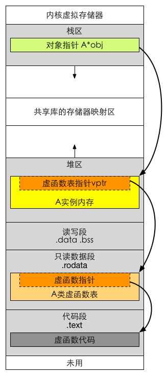

# C++多态实现及原理

​	C++的多态性用一句话概括就是：在基类的函数前加上virtual关键字，在派生类中重写该函数，运行时将会根据对象的实际类型来调用相应的函数。如果对象类型是派生类，就调用派生类的函数；如果对象类型是基类，就调用基类的函数。

[TOC]

## 成员函数在内存中的存储方式

​	原文：https://blog.csdn.net/fuzhongmin05/article/details/59112081 

​	用类去定义对象时，系统会为每一个对象分配存储空间。如果一个类包括了数据和函数，要分别为数据和函数的代码分配存储空间。按理说，如果用同一个类定义了10个对象，那么就需要分别为10个对象的数据和函数代码分配存储单元，如下图所示。


​	能否只用一段空间来存放这个共同的函数代码段，在调用各对象的函数时，都去调用这个公用的函数代码。如下图所示。


​	显然，这样做会大大节约存储空间。C++编译系统正是这样做的，**因此每个对象所占用的存储空间只是该对象的数据部分（虚函数指针和虚基类指针也属于数据部分）所占用的存储空间，而不包括函数代码所占用的存储空间**

看如下测试代码：

```C++
class D  
{  
public:  
    void printA()  
    {  
        cout<<"printA"<<endl;  
    }  
    virtual void printB()  
    {  
        cout<<"printB"<<endl;  
    }  
};  
int main(void)
{
	D *d=NULL;
	d->printA();
	d->printB();
}
//运行后
d->printA();正常输出
d->printB();出现内存异常，找不到虚表指针地址
```

​	C++程序的内存格局通常分为四个区：全局数据区(data area)，代码区(code area)，栈区(stack area)，堆区(heap area)(即自由存储区)。全局数据区存放全局变量，静态数据和常量；所有类成员函数和非成员函数代码存放在代码区；为运行函数而分配的局部变量、函数参数、返回数据、返回地址等存放在栈区；余下的空间都被称为堆区。根据这个解释，我们可以得知在类的定义时，类成员函数是被放在代码区，而类的静态成员变量在类定义时就已经在全局数据区分配了内存，因而它是属于类的。对于非静态成员变量，我们是在类的实例化过程中(构造对象)才在栈区或者堆区为其分配内存，是为每个对象生成一个拷贝，所以它是属于对象的。

​	应当说明，常说的“某某对象的成员函数”，是从逻辑的角度而言的，而成员函数的存储方式，是从物理的角度而言的，二者是不矛盾的。

​	下面我们再来讨论下类的静态成员函数和非静态成员函数的区别：静态成员函数和非静态成员函数都是在类的定义时放在内存的代码区的，因而可以说它们都是属于类的，但是类为什么只能直接调用静态类成员函数，而非静态类成员函数(即使函数没有参数)只有类对象才能调用呢？原因是类的非静态类成员函数其实都内含了一个指向类对象的指针型参数(即this指针)，因而只有类对象才能调用(此时this指针有实值)。

​	回答开头的问题，答案是输出“printA”后，程序崩溃。类中包括成员变量和成员函数。new出来的只是成员变量，成员函数始终存在，所以如果成员函数未使用任何成员变量的话，不管是不是static的，都能正常工作。需要注意的是，虽然调用不同对象的成员函数时都是执行同一段函数代码，但是执行结果一般是不相同的。不同的对象使用的是同一个函数代码段，它怎么能够分别对不同对象中的数据进行操作呢？原来C++为此专门设立了一个名为this的指针，用来指向不同的对象。

​	需要说明，不论成员函数在类内定义还是在类外定义，成员函数的代码段都用同一种方式存储。不要将成员函数的这种存储方式和inline(内联)函数的概念混淆。不要误以为用inline声明(或默认为inline)的成员函数，其代码段占用对象的存储空间，而不用inline声明的成员函数，其代码段不占用对象的存储空间。不论是否用inline声明(或默认为inline)，成员函数的代码段都不占用对象的存储空间。用inline声明的作用是在调用该函数时，将函数的代码段复制插人到函数调用点，而若不用inline声明，在调用该函数时，流程转去函数代码段的入口地址，在执行完该函数代码段后，流程返回函数调用点。inline与成员函数是否占用对象的存储空间无关，它们不属于同一个问題，不应搞混。

## 虚函数概念

1：用virtual关键字申明的函数叫做虚函数，虚函数肯定是类的成员函数。  

2：存在虚函数的类都有一个一维的虚函数表叫做虚表，类的对象有一个指向虚表开始的虚指针。虚表是和类对应的，虚表指针是和对象对应的。  

3：多态性是一个接口多种实现，是面向对象的核心，分为类的多态性和函数的多态性。  

4：多态用虚函数来实现，结合动态绑定.  

5:纯虚函数是虚函数再加上 = 0；  

6：抽象类是指包括至少一个纯虚函数的类。

纯虚函数:virtual void fun()=0;即抽象类！必须在子类实现这个函数，即先有名称，没有内容，在派生类实现内容。

```c++
#include "stdafx.h"
#include <iostream> 
#include <stdlib.h>
using namespace std; 

class Father
{
public:
    void Face()
    {
        cout << "Father's face" << endl;
    }

    void Say()
    {
        cout << "Father say hello" << endl;
    }
};


class Son:public Father
{
public:     
    void Say()
    {
        cout << "Son say hello" << endl;
    }
};

void main()
{
    Son son;
    Father *pFather=&son; // 隐式类型转换
    pFather->Say();
}
```

结果为：

```
Father say hello
```

​	我们在main()函数中首先定义了一个Son类的对象son，接着定义了一个指向Father类的指针变量pFather，然后利用该变量调用pFather->Say().估计很多人往往将这种情况和c++的多态性搞混淆，认为son实际上是Son类的对象，应该是调用Son类的Say，输出"Son say hello",然而结果却不是.

从编译的角度来看:

　　c++编译器在编译的时候，要确定每个对象调用的函数（非虚函数）的地址，这称为早期绑定，当我们将Son类的对象son的地址赋给pFather时，c++编译器进行了类型转换，此时c++编译器认为变量pFather保存的就是Father对象的地址，当在main函数中执行pFather->Say(),调用的当然就是Father对象的Say函数

​	正如很多人那么认为，在上面的代码中，我们知道pFather实际上指向的是Son类的对象，我们希望输出的结果是son类的Say方法，那么想到达到这种结果，就要用到虚函数了。

　　前面输出的结果是因为编译器在编译的时候，就已经确定了对象调用的函数的地址，要解决这个问题就要使用晚绑定，当编译器使用晚绑定时候，就会在运行时再去确定对象的类型以及正确的调用函数，而要让编译器采用晚绑定，就要在基类中声明函数时使用virtual关键字，这样的函数我们就称之为虚函数，一旦某个函数在基类中声明为virtual，那么在所有的派生类中该函数都是virtual，而不需要再显式地声明为virtual。

```c++
#include "stdafx.h"
#include <iostream> 
#include <stdlib.h>
using namespace std; 

class Father
{
public:
    void Face()
    {
        cout << "Father's face" << endl;
    }

    virtual void Say()
    {
        cout << "Father say hello" << endl;
    }
};


class Son:public Father
{
public:     
    void Say()
    {
        cout << "Son say hello" << endl;
    }
};

void main()
{
    Son son;
    Father *pFather=&son; // 隐式类型转换
    pFather->Say();
}
```

结果为：

```
Son say hello
```

我们发现结果是"Son say hello"也就是根据对象的类型调用了正确的函数，那么当我们将Say()声明为virtual时，背后发生了什么。

　　编译器在编译的时候，发现Father类中有虚函数，此时编译器会为每个包含虚函数的类创建一个虚表(即 vtable)，该表是一个一维数组，在这个数组中存放每个虚函数的地址，


​	那么如何定位虚表呢？编译器另外还为每个对象提供了一个虚表指针(即vptr)，这个指针指向了对象所属类的虚表，在程序运行时，根据对象的类型去初始化vptr，从而让vptr正确的指向了所属类的虚表，从而在调用虚函数的时候，能够找到正确的函数，对于第二段代码程序，由于pFather实际指向的对象类型是Son，因此vptr指向的Son类的vtable，当调用pFather->Son()时，根据虚表中的函数地址找到的就是Son类的Say()函数.

　　正是由于每个对象调用的虚函数都是通过虚表指针来索引的，也就决定了虚表指针的正确初始化是非常重要的，换句话说，在虚表指针没有正确初始化之前，我们不能够去调用虚函数，那么虚表指针是在什么时候，或者什么地方初始化呢？

　　答案是在构造函数中进行虚表的创建和虚表指针的初始化，在构造子类对象时，要先调用父类的构造函数，此时编译器只“看到了”父类，并不知道后面是否还有继承者，它初始化父类对象的虚表指针，该虚表指针指向父类的虚表，当执行子类的构造函数时，子类对象的虚表指针被初始化，指向自身的虚表。

## 总结(基类有虚函数的):

　　1:每一个类都有虚表

　　2:虚表可以继承，如果子类没有重写虚函数，那么子类虚表中仍然会有该函数的地址，只不过这个地址指向的是基类的虚函数实现，如果基类有3个虚函数，那么基类的虚表中就有三项(虚函数地址)，派生类也会虚表，至少有三项，如果重写了相应的虚函数，那么虚表中的地址就会改变，指向自身的虚函数实现，如果派生类有自己的虚函数，那么虚表中就会添加该项。

　　3：派生类的虚表中虚地址的排列顺序和基类的虚表中虚函数地址排列顺序相同。

　　这就是c++中的多态性，当c++编译器在编译的时候，发现Father类的Say()函数是虚函数，这个时候c++就会采用晚绑定技术，也就是编译时并不确定具体调用的函数，而是在运行时，依据对象的类型来确认调用的是哪一个函数，这种能力就叫做c++的多态性，我们没有在Say()函数前加virtual关键字时，c++编译器就确定了哪个函数被调用，这叫做早期绑定。

　　c++的多态性就是通过晚绑定技术来实现的。

　　c++的多态性用一句话概括就是:在基类的函数前加上virtual关键字，在派生类中重写该函数，运行时将会根据对象的实际类型来调用相应的函数，如果对象类型是派生类，就调用派生类的函数，如果对象类型是基类，就调用基类的函数。

　　虚函数是在基类中定义的，目的是不确定它的派生类的具体行为，例如:

　　定义一个基类:class Animal //动物，它的函数为breathe()

　　再定义一个类class Fish //鱼。它的函数也为breathe()

　　再定义一个类class Sheep //羊，它的函数也为breathe()

将Fish，Sheep定义成Animal的派生类，然而Fish与Sheep的breathe不一样，一个是在水中通过水来呼吸，一个是直接呼吸，所以基类不能确定该如何定义breathe，所以在基类中只定义了一个virtual breathe，它是一个空的虚函数，具体的函数在子类中分别定义，程序一般运行时，找到类，如果它有基类，再找到它的基类，最后运行的是基类中的函数，这时，它在基类中找到的是virtual标识的函数，它就会再回到子类中找同名函数，派生类也叫子类，基类也叫父类，这就是虚函数的产生，和类的多态性的体现。

　　这里的多态性是指类的多态性。

　　函数的多态性是指一个函数被定义成多个不同参数的函数。当你调用这个函数时，就会调用不同的同名函数。

```C++
#include "stdafx.h"
#include <iostream> 
#include <stdlib.h>
using namespace std; 

class CA 
{ 
public: 
    void f() 
    { 
        cout << "CA f()" << endl; 
    } 
    virtual void ff() 
    { 
        cout << "CA ff()" << endl; 
        f(); 
    } 
}; 

class CB : public CA 
{ 
public : 
    virtual void f() 
    { 
        cout << "CB f()" << endl; 
    } 
    void ff() 
    { 
        cout << "CB ff()" << endl; 
        f(); 
        CA::ff(); 
    } 
}; 
class CC : public CB 
{ 
public: 
    virtual void f() 
    { 
        cout << "C f()" << endl; 
    } 
}; 

int main() 
{ 
    CB b; 
    CA *ap = &b; 
    CC c; 
    CB &br = c; 
    CB *bp = &c; 

    ap->f(); 
    cout << endl;

    b.f(); 
    cout << endl;

    br.f(); 
    cout << endl;

    bp->f(); 
    cout << endl;

    ap->ff(); 
    cout << endl;

    bp->ff(); 
    cout << endl;

    return 0; 
}
```

结果为：

```
CA f()

CB f()

C f()

C f()

CB ff()
CB f()
CA ff()
CA f()

CB ff()
C f()
CA ff()
CA f()
```

## 虚函数表

来自：<https://www.cnblogs.com/hushpa/p/5707475.html>

```c++
#include <iostream>

using namespace std;

class Base {
public:
    virtual void f() {cout<<"base::f"<<endl;}
    virtual void g() {cout<<"base::g"<<endl;}
    virtual void h() {cout<<"base::h"<<endl;}
};

class Derive : public Base{
public:
    void g() {cout<<"derive::g"<<endl;}
};

//可以稍后再看
int main () {
    cout<<"size of Base: "<<sizeof(Base)<<endl;

    typedef void(*Func)(void);
    Base b;
    Base *d = new Derive();

    long* pvptr = (long*)d;
    long* vptr = (long*)*pvptr;
    Func f = (Func)vptr[0];
    Func g = (Func)vptr[1];
    Func h = (Func)vptr[2];

    f();
    g();
    h();

    return 0;
}
//结果
/*
size of Base: 8
base::f
derive::g
base::h
说明Derive的虚函数表结构跟上面分析的是一致的：
    d对象的首地址就是vptr指针的地址-pvptr，
    取pvptr的值就是vptr-虚函数表的地址
    取vptr中[0][1][2]的值就是这三个函数的地址
    通过函数地址就直接可以运行三个虚函数了。
    函数表中Base::g()函数指针被Derive中的Derive::g()函数指针覆盖， 所以执行的时候是调用的Derive::g()
    */
```

(1) 32位os 指针长度为4字节， 64位os 指针长度为8字节， 下面的分析环境为64位 linux & g++ 4.8.4.
(2) new一个对象时， 只为类中成员变量分配空间， 对象之间共享成员函数。

包含虚函数的类才会有虚函数表， 同属于一个类的对象共享虚函数表， 但是有各自的_vptr.
    虚函数表实质是一个指针数组，里面存的是虚函数的函数指针。

Base中虚函数表结构：


Derive中虚函数表结构：


## 多继承虚表


## vptr. vtable内存位置

refer  http://www.tuicool.com/articles/iUB3Ebi

